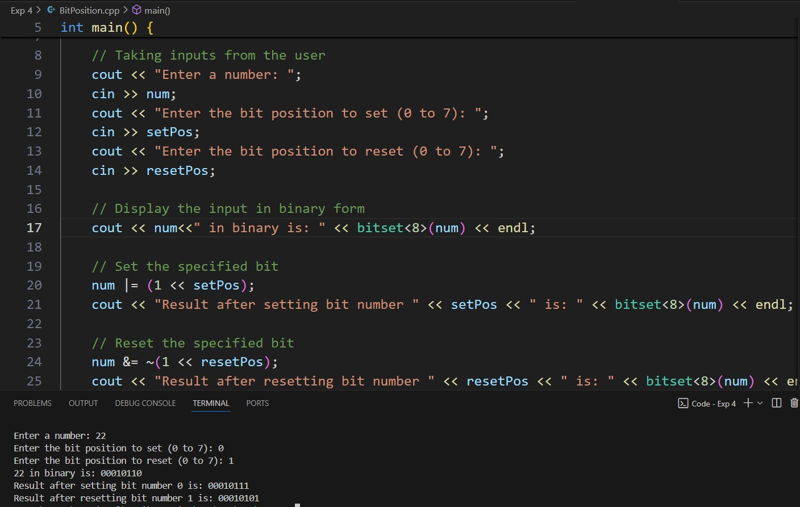

# Experiment 4
## Program 1
### Aim: 
Take two numbers as input from the user and perform bitwise logical operations on those numbers.
### Software used: 
Visual Studio Code
### Theory:
Bitwise operators in C++ perform operations on individual bits of integer data types.
###
AND (&): Performs a bitwise AND operation.
###
OR (|): Performs a bitwise OR operation.
###
XOR (^): Performs a bitwise XOR (exclusive OR) operation.
###
NOT (~): Performs a bitwise NOT operation, flipping all the bits.
###
Left Shift (<<): Shifts the bits of the operand to the left by a specified number of positions.
###
Right Shift (>>): Shifts the bits of the operand to the right by a specified number of positions.
###
Bitwise operations are often used in low-level programming, such as setting, clearing, or toggling specific bits within a number.
### Output:

### Conclusion:
We learnt what Bitwise Operators are in C++.

## Program 2
### Aim: 
Take a number as input from user along with bit position numbers to be set and reset in the inputted number
### Software used: 
Visual Studio Code
### Theory:
In C++, bitwise shift operators allow you to shift bits in a number to the left or right:
###
Left Shift (<<): Shifts bits to the left, adding zeros on the right.
Equivalent to multiplying the number by 2^𝑛.
###
Right Shift (>>): Shifts bits to the right, removing bits from the right.
For unsigned types, zeros are added on the left. For signed types, the sign bit is preserved.
Equivalent to dividing the number by 2^𝑛. 
### Output:

### Conclusion:
We learnt about bit position shifting with Bitwise Operators in C++.
